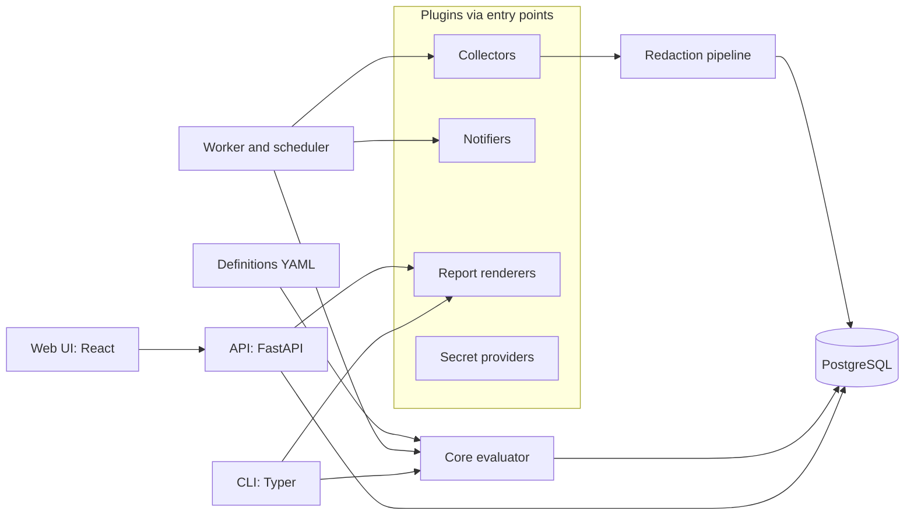

# dsec-metrics: build instructions for the coding agent

This file is the standing brief for building dsec-metrics, an open-source, self-hosted compliance metrics and audit evidence platform for data security teams. Keep it at the repository root. Read it at the start of every session and follow it over your own defaults. When this file and a request in chat disagree, ask before acting.

The working name is dsec-metrics. It can be renamed later; keep the name in one constant and one place in the docs so a rename is cheap.

## How we work

- Work one milestone at a time, in the order listed under "Milestones". Do not start the next milestone until the current one meets its acceptance criteria and I have reviewed it.
- Before writing code for a milestone, write a short plan in `docs/plans/mN.md`: what you will build, the files you expect to touch, open questions, and risks. Stop and wait for my approval.
- Keep commits small and use Conventional Commits (`feat:`, `fix:`, `docs:`, `test:`, `chore:`, `sec:`).
- Ask before adding any dependency not named in this file. Prefer the standard library and the libraries already chosen.
- Write tests in the same change as the code they cover. For the evaluator, write the tests first.
- Record every significant design decision as an ADR in `docs/adr/NNNN-title.md` (context, decision, consequences).
- Run the full CI suite locally before saying a task is done, and report what you ran and the results.
- If something is ambiguous, write the question down in the plan instead of guessing.
- Never use real company data, real credentials, real hostnames, or employer names anywhere: code, fixtures, screenshots, docs, commit messages.

## What we are building

A platform that turns agreed metric and control definitions into measured results, shows them in one dashboard per audience, and produces audit evidence packages that an auditor can verify independently.

The target user is the data security compliance team at a large regulated company such as a bank, card issuer or payments processor. The target deployment is inside that company's network, behind its identity provider, after its security review. Every design choice should make that review easier to pass.

The problems it solves:

- Evidence for audits is collected by hand, as screenshots and exports, before every assessment.
- Different teams report different numbers for the same thing because nobody agreed on a definition.
- Dashboards try to serve everyone and end up useful to no one.
- Auditors cannot reproduce a number, so they re-test it.
- Exceptions and findings age quietly until an audit finds them.

Positioning. Compliance automation SaaS products such as Vanta and Drata focus on companies getting certified. Open-source GRC tools such as CISO Assistant and Eramba manage frameworks, risk registers and assessments. dsec-metrics focuses on measured control effectiveness and verifiable evidence for teams that run their own programs, fully self-hosted, with no data leaving the company. It integrates with an existing GRC tool and does not try to replace it.

Non-goals:

- It is not a GRC system of record, a SIEM, a vulnerability scanner or a ticketing system.
- It installs no agents on endpoints or servers.
- It never writes to source systems. Every collector is read-only.

## Design principles

1. Definitions as code. Metrics, controls, framework mappings and dashboards are YAML files under version control, validated by a schema. The UI can edit them, but the YAML is the source of truth and every change is versioned.
2. Everything pluggable. Collectors, notifiers, report renderers and secret providers are plugins discovered through Python entry points. A team adds a data source by installing a package, not by forking the project.
3. Evidence you can verify. Every number links to the definition version, the query, and the hashed source data that produced it. Every report package carries a manifest of SHA-256 hashes and a signature.
4. Secure by default. Deny by default, least privilege, no secrets in the database, no sensitive cardholder data stored, no telemetry.
5. Useful on first run. `docker compose up` plus one command loads synthetic data, default framework packs, default metrics and the three audience dashboards.
6. Fast, clear and accessible. The UI is clean and quick, works in light and dark mode, and meets WCAG 2.2 AA.
7. Easy to deploy. Docker Compose is the supported deployment. One `.env` file and `docker compose up -d` bring up a working, TLS-protected install on a single Linux host, including hosts with no internet access. A Helm chart for Kubernetes is optional and comes after v1.0.

## Core concepts and data model

| Entity | Purpose | Main fields |
| --- | --- | --- |
| Framework | A standard such as NIST CSF 2.0 or PCI DSS v4.0.1 | id, name, version, source_url |
| Requirement | One requirement ID inside a framework | framework_id, ref (for example "3.7.4"), short_title written by us |
| Control | An internal control the company operates | id, name, owner, description, requirement refs, metric ids |
| Metric | A KPI, KRI or KCI definition | id, type, question, owner, source, formula, frequency, thresholds, action_when_red, baseline, version |
| Collector instance | A configured plugin with its connection settings | plugin name, version, config, secret references, schedule |
| Collection run | One execution of a collector instance | started_at, finished_at, status, record_count, error |
| Record batch | Raw data from one query in one run, after redaction | run_id, query, params, sha256, redaction summary, storage ref |
| Measurement | A metric value for one period and one dimension slice | metric_id, definition_version, as_of, dimensions, value, status, input batch hashes |
| Evidence item | A file or record set attached to a control and period | control_id, period, sha256, source, collected_at |
| Exception | An approved deviation from a control | control_id, reason, compensating controls, risk rating, owner, approved_at, expires_at, status, root_cause |
| Finding | An issue raised by an audit or assessment | source, severity, control_id, owner, due_date, status, repeat flag |
| Report | A generated package | type, scope, period, manifest sha256, signature, generated_by |
| Audit event | One user or system action | actor, action, target, timestamp, prev_hash, hash |

Dimensions available on measurements: business unit, application, environment, region. Every dashboard and report can filter by them.

## Architecture



Modules and their boundaries:

- `core`: domain models, schemas, the evaluator and threshold logic. Pure Python with no I/O, no database and no network. Everything else depends on it; it depends on nothing in the project.
- `plugins`: the plugin SDK (base classes, config models, test helpers) and the built-in plugins.
- `worker`: schedules collector runs, applies redaction, writes record batches, triggers evaluation, sends notifications.
- `api`: FastAPI app with OpenAPI docs, authentication, authorization and all reads and writes.
- `web`: React front end. Talks only to the API.
- `reports`: builds report packages, renders PDF, XLSX, CSV and JSON, writes manifests and signatures.
- `cli`: validate definitions, run a collector once, evaluate, build and verify packages, scaffold a new plugin, load demo data.

Entry point groups: `dsec_metrics.collectors`, `dsec_metrics.notifiers`, `dsec_metrics.renderers`, `dsec_metrics.secret_providers`.

## Tech stack

| Layer | Choice | Notes |
| --- | --- | --- |
| Language | Python 3.12, TypeScript 5 | `mypy --strict` and `tsc --strict` |
| Packaging | uv with a lock file; pnpm for the front end | Hash-pinned dependencies |
| API | FastAPI, Pydantic v2 | OpenAPI schema published in docs |
| Database | PostgreSQL 16, SQLAlchemy 2, Alembic | Postgres in every environment, including tests |
| Scheduling | APScheduler in the worker, Postgres job store | No Redis in v1 |
| Front end | React 18, Vite, Tailwind CSS, shadcn/ui on Radix | Radix gives accessible primitives |
| Data fetching and tables | TanStack Query, TanStack Table | |
| Charts | Apache ECharts via echarts-for-react | Accessible labels and data table fallback required |
| Icons | lucide-react | |
| Reports | Jinja2, WeasyPrint for PDF, openpyxl for XLSX | |
| Crypto | `cryptography` library | Ed25519 signatures, AES-256-GCM, SHA-256 |
| Auth | Authlib for OIDC | Tested with Keycloak in CI; documented for Okta and Entra ID |
| CLI | Typer | |
| Tests | pytest, Hypothesis, Testcontainers, Vitest, Playwright, axe-core | |
| Docs | MkDocs Material | Published to GitHub Pages |
| Containers | Multi-stage builds, non-root, read-only root filesystem | Images published to GitHub Container Registry and signed |
| Deployment | Docker Compose v2 (`compose.yaml`) | The supported path; see "Deployment with Docker Compose" |
| Reverse proxy | Caddy | TLS, security headers, serves the built front end, routes `/api` |

## Definition language

All definitions live in `content/` and are validated by `dsec-metrics validate`. Filters are structured (field, operator, value). There is no free-form expression language and nothing is ever passed to `eval` or `exec`.

A metric:

```yaml
id: KRI-03
name: Exceptions open more than 180 days
type: kri
question: Are exceptions staying temporary?
owner: data-security-exceptions-lead
audience: [risk_committee, management]
source:
  collector: grc_exceptions
  query: open_exceptions
evaluation:
  kind: count
  filters:
    - {field: status, op: eq, value: approved}
    - {field: days_since_approval, op: gt, value: 180}
  group_by: [business_unit]
frequency: monthly
thresholds:
  green: {max: 5}
  amber: {max: 15}
  red: {above: 15}
  overrides:
    - {dimension: {business_unit: cards}, red: {above: 8}}
action_when_red: Escalate owners to the business unit CIO and include in the risk committee pack.
frameworks: ["nist-csf-2.0:GV.RM"]
baseline: {value: 22, method: manual count from register, date: 2026-10-31}
approved_by: [manager, technology_risk, internal_audit]
review_by: 2027-04-30
```

Evaluation kinds for v1: `count`, `sum`, `ratio`, `percentage`, `median`, `percentile`, `age_over`, `sla_breach`, `latest_value`. Custom kinds are registered in code through a plugin and go through code review like everything else.

A control:

```yaml
id: DS-KM-04
name: Cryptographic keys are rotated at the end of their cryptoperiod
owner: crypto-services-lead
requirements: ["pci-dss-4.0.1:3.7.4", "nist-csf-2.0:PR.DS-01"]
metrics: [KRI-04]
evidence:
  - {collector: aws, query: kms_key_rotation, retain_days: 400}
  - {collector: vault, query: transit_key_versions, retain_days: 400}
```

A framework pack holds IDs and short titles we write ourselves:

```yaml
id: pci-dss-4.0.1
name: PCI DSS
version: 4.0.1
source_url: https://www.pcisecuritystandards.org/
requirements:
  - {ref: "3.7.4", short_title: Key changes at end of cryptoperiod}
  - {ref: "12.3.3", short_title: Cryptographic inventory reviewed annually}
```

Do not copy requirement text from PCI DSS, ISO/IEC 27001 or the AICPA Trust Services Criteria. Those documents are copyrighted. NIST CSF 2.0 is a US government publication and its text can be included.

A dashboard:

```yaml
id: risk-committee
title: Risk committee
audience: risk_committee
refresh: monthly
layout:
  - {widget: rag_list, metrics: [KRI-01, KRI-03, KRI-04, KRI-05], width: 12}
  - {widget: trend, metric: KRI-03, periods: 12, width: 6}
  - {widget: heatmap, rows: business_unit, columns: control, value: status, width: 6}
```

Widget types for v1: `stat`, `trend`, `bar`, `table`, `rag_list`, `heatmap`, `exceptions_aging`, `findings_burndown`.

## Collector SDK

```python
class CollectorConfig(BaseModel):
    """Plugin-specific settings. Secrets are references, never values."""


class RecordBatch(BaseModel):
    query: str
    params: dict[str, Any]
    records: list[dict[str, Any]]
    collected_at: datetime


class Collector(ABC):
    name: ClassVar[str]
    version: ClassVar[str]
    config_model: ClassVar[type[CollectorConfig]]
    queries: ClassVar[dict[str, str]]  # query name -> description
    required_permissions: ClassVar[list[str]]  # documented read-only scopes

    def __init__(self, config: CollectorConfig, secrets: SecretResolver) -> None: ...

    @abstractmethod
    def test_connection(self) -> ConnectionResult: ...

    @abstractmethod
    def collect(self, query: str, params: dict[str, Any], as_of: date) -> Iterator[RecordBatch]: ...
```

Rules every collector follows:

- Read-only credentials only. The README for each collector lists the exact minimum permissions it needs.
- Secrets come from a secret provider reference such as `vault://kv/dsec/jira#token`, `aws-sm://dsec/jira`, or `env://JIRA_TOKEN`. Never plain values in config files or the database.
- Timeouts, retries with backoff, pagination and rate-limit handling are built into the SDK base class, not reimplemented per plugin.
- Output goes through the redaction pipeline before anything is stored. The pipeline drops fields marked sensitive, masks anything that looks like a card number (13 to 19 digits passing a Luhn check) to first six and last four, and records what it changed.
- Each stored batch records collector name and version, instance ID, query, params, start and finish times, record count, redaction summary, and the SHA-256 of the canonical JSON of the records.
- Contract tests run against recorded fixtures. CI never calls live services.

`dsec-metrics plugin new collector <name>` scaffolds a new collector package with the entry point, config model, a sample query, fixtures and tests.

Built-in collectors by milestone:

- M1: `file` (CSV and JSON), `sample` (synthetic data generator).
- M4: `rest` (config-driven generic REST), `aws` (KMS rotation, ACM expiry, Config rule compliance, IAM access key age), `vault` (audit device logs, transit key versions, auth methods), `jira`, `servicenow` (table API), `github` (branch protection, code scanning and Dependabot alerts).
- M6 and later: `azure` (Key Vault, Policy), `gcp` (Cloud KMS, Security Command Center), `okta`, `splunk` (saved searches), and DSPM products through `rest` templates.

## Evaluator

- A pure function: definition version plus input batches plus `as_of` date produces measurements. Same inputs, same output, every time.
- Property-based tests with Hypothesis for every evaluation kind and every threshold shape.
- Each measurement stores the definition hash and the hashes of the input batches.
- Changing a definition creates a new version. Past measurements are never overwritten; recomputation writes new rows tagged with the new version.
- Status is `green`, `amber`, `red` or `unknown`. A metric is `unknown` when there is no data or when the last successful collection is older than twice its frequency. `unknown` is shown distinctly and never displayed as green.
- Each measurement carries its change from the previous period, from baseline, and its distance to target.

## Security requirements

Treat each item as a requirement with a test or a documented control.

Authentication

- OIDC with PKCE against the company identity provider. Keycloak in CI; setup guides for Okta and Entra ID. MFA is enforced by the identity provider.
- Local accounts exist only in development mode, with Argon2id hashing, and the app refuses to start in production mode with local accounts enabled.
- Short-lived sessions, secure HttpOnly SameSite cookies, and CSRF protection for cookie-based requests.
- API tokens for automation are scoped, expiring and shown once.

Authorization

- Roles: `admin`, `metric_owner`, `reviewer`, `viewer`, `auditor`, `service`.
- The `auditor` role is read-only, time-boxed, and scoped to named frameworks and periods. Every download by an auditor is logged.
- Business unit scoping: users see only the business units they are granted.
- Deny by default. All permission checks go through one policy module. CI fails if any API route lacks an authorization test.

Data protection

- TLS for every connection. HSTS on the web app.
- No secrets in the database. Collector configs store references; any secret-like field that must be stored is encrypted with AES-256-GCM using envelope encryption through a key provider plugin (Vault transit, AWS KMS, or a local key file in development).
- No full card numbers or sensitive authentication data are ever stored. A test inserts Luhn-valid numbers through every collector path and fails if any reaches the database unmasked.
- Retention per evidence type, configurable, with a purge job that logs what it deleted.

Audit log

- Every user and system action is written to an append-only table. Each entry includes the hash of the previous entry.
- `dsec-metrics audit verify` recomputes the chain and reports the first broken link.
- Events are also emitted as JSON lines to stdout for the company SIEM.

Web and API security

- Strict Content Security Policy with no inline scripts, plus standard security headers.
- CORS locked to the configured origin. Rate limits and request size limits on every route.
- All input validated by Pydantic models. All output encoded by the framework.
- SSRF protection for the `rest` collector and any URL setting: an admin-managed host allowlist, and blocked link-local, loopback and cloud metadata addresses.

Supply chain and CI gates (fail the build on high or critical)

- `ruff`, `mypy --strict`, `bandit`, `semgrep` with OWASP and language rulesets.
- `pip-audit`, `osv-scanner` for both ecosystems, `gitleaks` for secrets.
- `trivy` scan of every image. `zizmor` for GitHub Actions workflow security.
- CycloneDX SBOM for every release, images signed with cosign keyless signing, and SLSA provenance generated in GitHub Actions.
- Dependabot or Renovate with grouped weekly updates.

Runtime

- Containers run as non-root with a read-only root filesystem, dropped Linux capabilities and no shell in the final image.
- Health and readiness endpoints. Resource requests and limits and a NetworkPolicy example in the Helm chart.
- No telemetry and no outbound calls other than configured collectors, the identity provider and configured notifiers. Document an air-gapped install.
- Only standard algorithms: SHA-256, AES-256-GCM, Ed25519 or ECDSA P-256. Document running on FIPS-enabled base images.

Security documentation

- `SECURITY.md` with a private reporting channel.
- `docs/security/threat-model.md` using STRIDE, updated at the end of every milestone.
- `docs/security/architecture.md` written for an enterprise security reviewer: data flows, trust boundaries, stored data classes, encryption, authentication, authorization, logging, and the permission list for each collector.

## Audit reports and evidence packages

Report types:

1. Control evidence package: one control, one period, everything an auditor asks for in a request list item.
2. Framework period report: for example, PCI DSS requirements 3, 7, 8 and 10 for a quarter, with control status, metrics, exceptions and an evidence index.
3. Metric reproducibility report: definition version, query, input batch hashes, calculation steps and result, so an auditor can rerun the number.
4. Risk committee pack: one page, monthly, key risk indicators with status, owner and action.
5. Management report: monthly trends against baseline and target.
6. Exceptions register export with age, root cause and expiry.

Package format:

- A ZIP containing `report.pdf`, `report.xlsx`, an `evidence/` folder, and `manifest.json`.
- The manifest lists every file with its SHA-256, size, source, collection time and the measurement or evidence record it belongs to.
- `manifest.sig` is a detached Ed25519 signature over the manifest. The PDF prints the public key fingerprint.
- `dsec-metrics verify package.zip` checks every hash and the signature and exits non-zero on any mismatch. A test changes one byte in one file and expects verification to fail.
- The PDF has a cover page, scope and period, method, summary counts by status, one section per control, a chain-of-custody section, and an appendix with the metric definitions used. Table of contents, page numbers, and a configurable "Prepared for" line with the date.
- Auditors get time-limited links to packages, and every access is logged.

## Dashboards and user interface

Default screens:

- Overview with an audience switcher.
- Team operations: queues, items past target, exceptions expiring soon, audit requests due, work by reviewer.
- Management: program KPIs as trends against baseline and target.
- Risk committee: key risk indicators with status, owner and action for anything red.
- Controls list and control detail: requirements, metrics, evidence, exceptions and findings for that control.
- Metric detail: current value, threshold bands, 12-period history, dimension breakdown, the source batches used, the definition and its version history.
- Exceptions: register with aging, expiry calendar and root-cause breakdown.
- Audit room: the auditor's landing page with frameworks, periods, packages and access log.
- Admin: collectors with connection tests and run history, definition validation, users and roles, audit log viewer.

Every number on screen is clickable, down to the definition, the measurement, and the source batch that produced it. This traceability is the main thing that sets the product apart. Build it into every widget from the start.

Customization:

- Dashboards are YAML files. A layout editor in the UI comes in M6 and writes back to YAML.
- Threshold overrides per business unit.
- Branding through config: product name, logo, accent color.
- Saved filters and shareable URLs that encode filter state.

Visual design:

- Neutral gray surfaces with one configurable accent color.
- Status is always shown with an icon and a text label as well as a color: green check, amber triangle, red octagon, gray question mark for `unknown`.
- Inter for text with tabular figures for numbers, an 8 px spacing grid, 12 px card corners, 0.5 to 1 px hairline borders, no gradients or heavy shadows.
- Light and dark mode from the first screen.
- Charts use a colorblind-safe palette and a single y-axis. Every chart has an accessible name and a "view as table" toggle.
- Empty states tell the user the next step, for example "Connect a collector to see data here" with a button.
- Skeleton loading states. Any wait over 300 ms shows what is loading.
- A print stylesheet for every dashboard so it can go straight into a meeting pack.

Performance and accessibility targets:

- Dashboards render in under 1.5 seconds on the sample dataset. Dashboard API calls stay under 300 ms at p95, served from pre-aggregated measurements.
- WCAG 2.2 AA. Full keyboard navigation. axe-core checks run in the Playwright suite and fail the build on violations.

## Default content

- Framework packs: NIST CSF 2.0 (full text allowed), PCI DSS v4.0.1, SOC 2 Trust Services Criteria and ISO/IEC 27001:2022 Annex A, each with IDs and short titles written by us.
- Data security metric pack: past-due high-severity findings, exceptions open over 180 days, exceptions per 100 reviews, keys past cryptoperiod, certificates expiring within 30 days, secrets older than rotation policy, encryption at rest coverage, MFA coverage for administrators of in-scope systems, privileged access reviews completed on time, card data found outside approved stores, tokenization adoption, audit requests answered on time, findings closed on time, repeat findings, design review cycle time, controls with automated evidence.
- Dashboard pack: team operations, management and risk committee.
- Sample data: 12 months, three business units, 40 controls, a seeded random generator so results are reproducible, and realistic patterns such as a spike in evidence requests before an audit and a few metrics that turn red and recover.

## Repository layout

```
dsec-metrics/
  src/dsec_metrics/
    core/            models, schemas, evaluator, thresholds
    plugins/
      sdk/           base classes, config models, test helpers
      collectors/    file, sample, rest, aws, vault, jira, servicenow, github
      notifiers/     email, slack, teams, ticket
      renderers/     pdf, xlsx, csv, json
      secrets/       env, vault, aws_sm, file
    worker/          scheduler, runs, redaction, notifications
    api/             routes, auth, policy, schemas
    reports/         package builder, manifest, signer, verifier
    cli/             commands
  web/               React app
  content/
    frameworks/      framework packs
    metrics/         metric definitions
    controls/        control definitions
    dashboards/      dashboard layouts
  deploy/
    compose/         docker-compose.yml and env examples
    helm/            Helm chart
  docs/              MkDocs site, ADRs, plans, security docs
  tests/             unit, contract, integration, e2e
  .github/workflows/ CI, release, docs
  SECURITY.md
  CONTRIBUTING.md
  CODE_OF_CONDUCT.md
  LICENSE            Apache-2.0
  README.md
```

## Quality bar

- Test coverage at least 90 percent for `core` and 80 percent overall.
- Property-based tests for the evaluator, contract tests with fixtures for every collector, integration tests against Postgres with Testcontainers, and Playwright end-to-end tests for the three audience dashboards, metric drill-down and report generation.
- `mypy --strict`, `tsc --strict`, `ruff`, `eslint` with no warnings.
- Every public module has docstrings and a page in the docs site.
- Semantic versioning, a maintained CHANGELOG, and release notes for each version.
- The README opens with a screenshot, a one-paragraph description, and a three-command quick start.

## Milestones

M0, foundations

- Repository skeleton, license, README, SECURITY.md, CONTRIBUTING.md.
- CI with every security gate listed above, even while there is little code.
- Docker Compose with api, worker, web and postgres; development auth only.
- ADR-0001 on the stack, first draft of the threat model.
- Acceptance: `docker compose up` shows a signed-in placeholder page and CI is green with all gates enabled.

M1, definitions and evaluator

- Pydantic schemas for metrics, controls, frameworks and dashboards; `dsec-metrics validate`.
- Evaluator with every v1 evaluation kind and threshold overrides.
- `file` and `sample` collectors, redaction pipeline, record batches with hashes, measurements with definition versions.
- `dsec-metrics demo` loads sample data and default content.
- Acceptance: `dsec-metrics demo` followed by `dsec-metrics status` prints the metric catalog with values and statuses; evaluator property tests pass; the card-number redaction test passes.

M2, dashboards

- API routes for metrics, measurements, controls, exceptions, findings and dashboards.
- The three audience dashboards, metric detail with drill-down to source batches, controls and exceptions screens, light and dark mode.
- Acceptance: Playwright and axe suites pass; the performance targets hold on the sample dataset.

M3, audit reports

- All six report types, package builder, manifest, Ed25519 signing, `verify` command.
- Auditor role with time-boxed, scoped access and download logging.
- Hash-chained audit log with `audit verify`.
- Acceptance: a generated package verifies; changing one byte makes verification fail; a broken audit chain is detected and located.

M4, real collectors

- `rest` with SSRF protections, `aws`, `vault`, `jira`, `servicenow`, `github`.
- `plugin new collector` scaffold command and a plugin author guide.
- Permission documentation for every collector.
- Acceptance: contract tests pass on fixtures; an AWS integration test passes against LocalStack; a plugin created with the scaffold installs and runs without changes to the core.

M5, enterprise readiness

- OIDC with Keycloak in CI, full RBAC, business unit scoping, API tokens.
- Field encryption through key provider plugins.
- Helm chart, air-gapped install guide, security architecture document.
- Signed images, SBOM and provenance on release.
- Acceptance: a Helm install on a kind cluster passes smoke tests; `cosign verify` succeeds on the release image; an OWASP ZAP baseline scan reports no high findings.

M6, customization and notifications

- Dashboard layout editor that writes YAML, branding config, saved filters.
- Notifier plugins for email, Slack, Microsoft Teams and ticket creation, triggered by status changes and upcoming expiries.
- Acceptance: a new dashboard built in the editor round-trips through YAML without loss; a metric turning red sends one notification to the configured channel and records it in the audit log.

v1.0 release checklist: all milestones accepted, docs site published, threat model current, demo recording in the README, and a tagged, signed release with SBOM.

## Never do these

- Commit real data, real secrets, real hostnames or employer names, including in fixtures and screenshots.
- Copy copyrighted framework text.
- Use `eval`, `exec`, pickle or any free-form expression language on definitions or user input.
- Give any collector write access to a source system.
- Add telemetry or outbound calls that are not configured by the operator.
- Disable or weaken a CI security gate to get a build to pass. Fix the cause or raise it with me.

## First task

Start with M0. Write `docs/plans/m0.md` with the plan, the files you will create, the CI jobs and tools you will configure, and any questions. Then stop and wait for my review.
