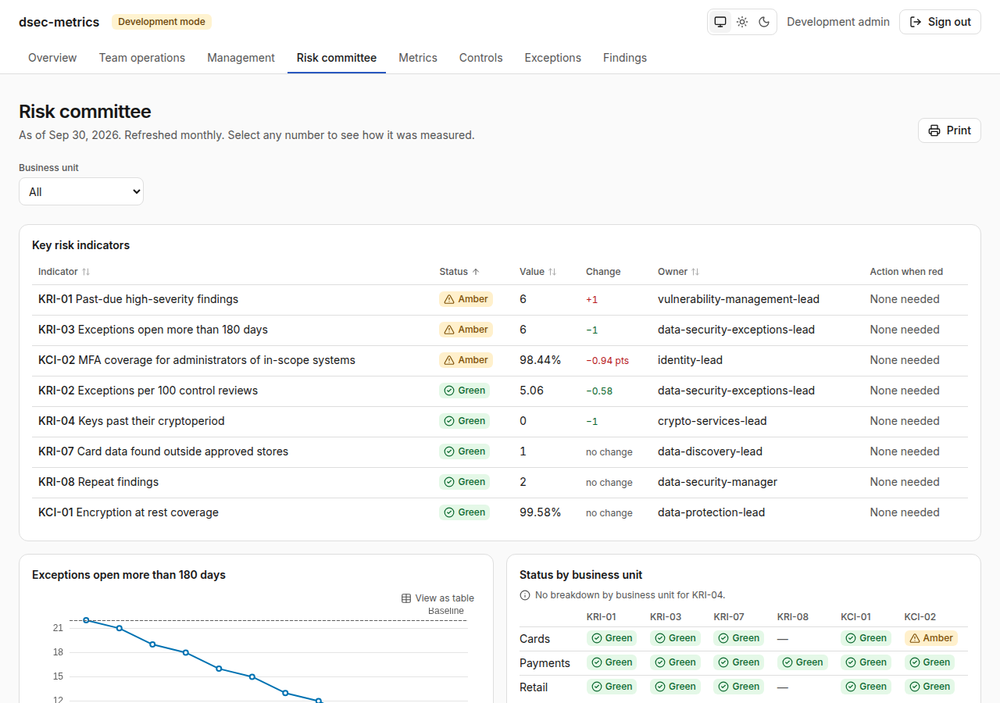

# dsec-metrics



dsec-metrics is a self-hosted compliance metrics and audit evidence platform for data security teams. It turns agreed metric and control definitions, kept as YAML in version control, into measured results, shows them on one dashboard per audience, and builds evidence packages that an auditor can verify on their own: every number links back to the definition version, the query and the hashed source data behind it, and every package carries a signed SHA-256 manifest. It runs entirely inside your network, behind your identity provider, with read-only collectors and no telemetry.

> Status: pre-alpha. M0 to M4 are in place: the Compose stack, development sign-in, CI with every security gate, definitions as code, the evaluator, redaction, the three audience dashboards with drill-down to source records, signed evidence packages with an independent verifier, auditor access, a hash-chained audit log, and read-only collectors for files, any JSON API, AWS, Vault, Jira, ServiceNow and GitHub behind an outbound host allowlist. OIDC, full RBAC and the Helm chart arrive in M5. See [CLAUDE.md](CLAUDE.md) for the full brief and milestones.

## Quick start

Requires Docker with Compose v2, `make` and `openssl`.

```sh
git clone https://github.com/FlavioImbertDomingos/dsec-metrics.git && cd dsec-metrics
make dev-secrets
docker compose up -d --wait
```

Open <https://localhost> and sign in as `dev-admin` with the password `make dev-secrets` printed. To load 12 months of synthetic data and print the metric catalog:

```sh
docker compose exec api dsec-metrics demo
docker compose exec api dsec-metrics status
```

The certificate comes from a local development CA that `make dev-secrets` created. Either accept the browser warning, or trust `deploy/compose/secrets/dev_ca.crt` in your operating system's certificate store for a clean padlock.

Development sign-in exists only in development mode. The app refuses to start in production mode with local accounts enabled; OIDC arrives in M5.

## What is in the box

| Path | Contents |
| --- | --- |
| `src/dsec_metrics/` | API (FastAPI), worker, CLI (Typer), and the core, plugin and report packages |
| `web/` | React front end |
| `content/` | framework packs, metric, control, dashboard and collector definitions |
| `deploy/` | Dockerfiles, Caddy configuration and Compose support files |
| `docs/` | MkDocs site, ADRs, milestone plans and security documents |

## Documentation

- [Architecture](docs/architecture.md)
- [Definition language](docs/definitions.md)
- [Plugin SDK](docs/plugins.md)
- [Dashboards and the read API](docs/dashboards.md)
- [Reports and evidence packages](docs/reports.md)
- [Audit log and auditors](docs/audit.md)
- [Architecture decision records](docs/adr/index.md)
- [Threat model](docs/security/threat-model.md)
- [Deploying with Docker Compose](docs/deployment/compose.md)
- [Contributing](CONTRIBUTING.md)
- [Security policy](SECURITY.md)

## License

Apache License 2.0. See [LICENSE](LICENSE).
