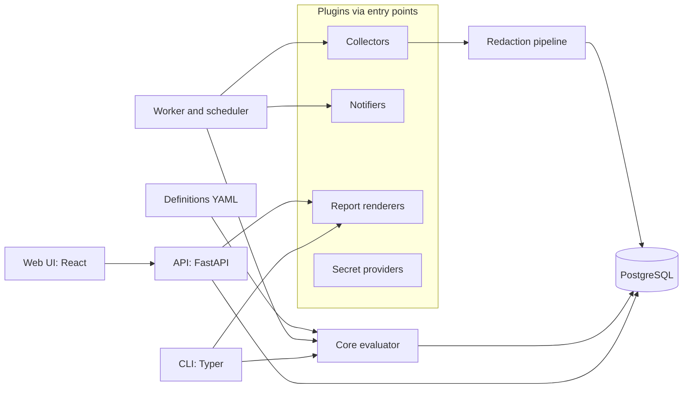
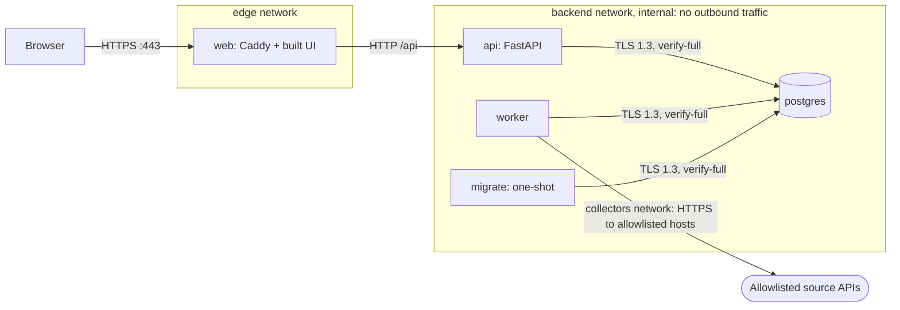

# Architecture

## Target design

| Module | Responsibility | May depend on |
| --- | --- | --- |
| `core` | Domain models, schemas, evaluator, thresholds. No I/O. | nothing in the project |
| `plugins` | Plugin SDK and built-in collectors, notifiers, renderers, secret providers | `core` |
| `worker` | Scheduling, collector runs, redaction, record batches, notifications | `core`, `plugins`, `db` |
| `api` | FastAPI app: authentication, the policy module, all reads and writes | `core`, `db`, `auth` |
| `reports` | Package builder, manifest, signer, verifier, renderers | `core`, `plugins` |
| `cli` | Validate, run, evaluate, build and verify packages, scaffold plugins | everything |
| `web` | React front end; talks only to the API | the API over HTTPS |

`tests/unit/test_import_boundaries.py` enforces the `core` rule: it fails if any module under `core` imports another project package or an I/O library.

## Containers and networks

- `web` is the only service with a published port, bound to 127.0.0.1 by default.
- The `backend` network is `internal: true`. The API and database cannot open outbound connections.
- Only the worker also joins the `collectors` network, which can reach outside. Collectors may call only hosts in `DSEC_COLLECTOR_ALLOWED_HOSTS`, checked on every request ([ADR-0013](adr/0013-outbound-http-and-ssrf.md)). With the allowlist empty, the default, nothing is called.
- The hop from Caddy to the API is plain HTTP inside the internal network. The threat model records this.
- `api`, `worker` and `migrate` run the same image with different commands.

## Request path

1. The browser loads the front end from Caddy. Caddy adds HSTS, a strict Content Security Policy and the other headers listed in [ADR-0003](adr/0003-compose-topology.md).
2. The front end calls `/api/meta` and `/api/me`. With no session, `/api/me` returns 401 and the sign-in page shows.
3. `POST /api/auth/login` checks the `Origin` header, the sign-in throttle and the Argon2id hash, then creates a server-side session and sets the `__Host-dsec_session` cookie. See [ADR-0004](adr/0004-development-authentication.md).
4. Every later request goes through `api/policy.py`. Unsafe methods also need the CSRF token from `/api/me` in `X-CSRF-Token` and a matching `Origin`.

## Data stored in M0

| Table | Contents | Sensitive fields |
| --- | --- | --- |
| `users` | username, display name, active flag | Argon2id hash (development mode only) |
| `sessions` | user, created, last seen, absolute expiry, client address | SHA-256 of the cookie token; the token itself is never stored |
| `auth_failures` | username, client address, time | none; rows are purged after the throttle window |

## Logging

Every process logs JSON lines to stdout. Sign-in, sign-out, failed sign-in and throttling events carry an `event` field for SIEM rules. The hash-chained audit table arrives in M3.
