# Screenshots

The default content with 12 months of synthetic sample data (`make demo`), in dark mode. Every name, owner and number is generated; nothing comes from a real organisation.

## Overview

The landing page: status counts per audience dashboard, and the indicators that are red.

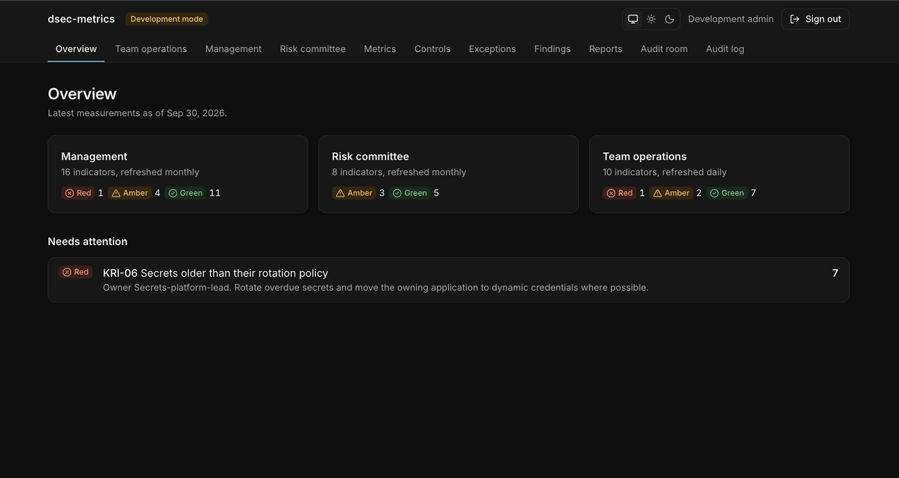

## Team operations

Daily indicators with owner and action, exceptions by age, past-due findings by severity, certificates expiring by business unit, and audit requests answered on time.

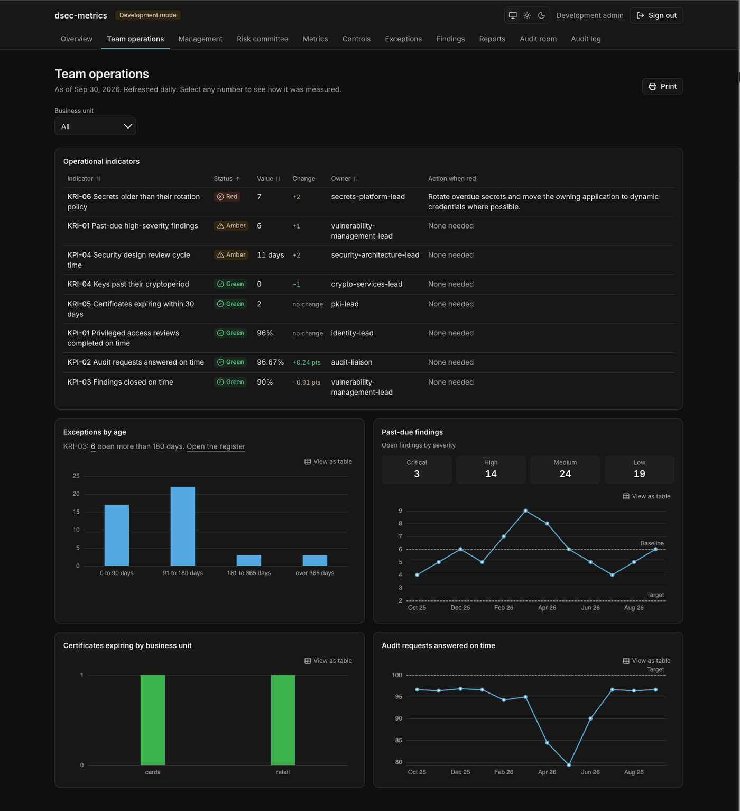

## Management

Program indicators as trends against baseline and target.

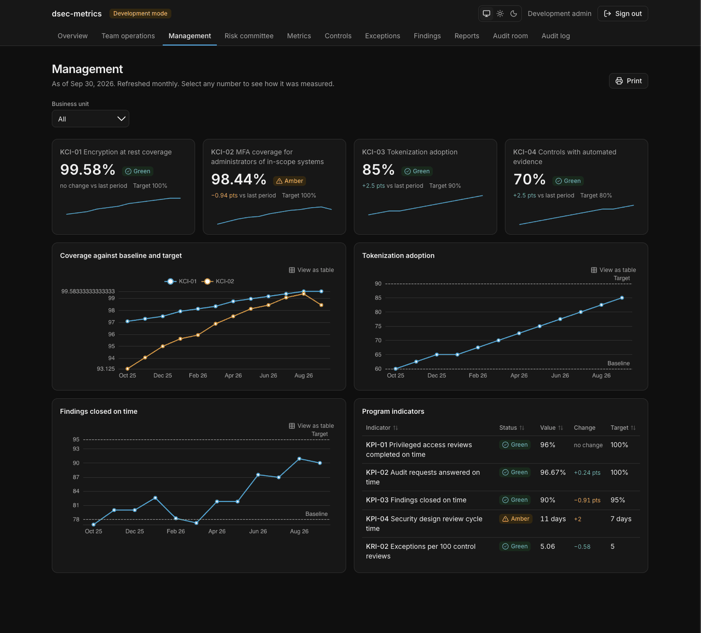

## Risk committee

Key risk indicators with status, change, owner and action, a trend, and status by business unit.

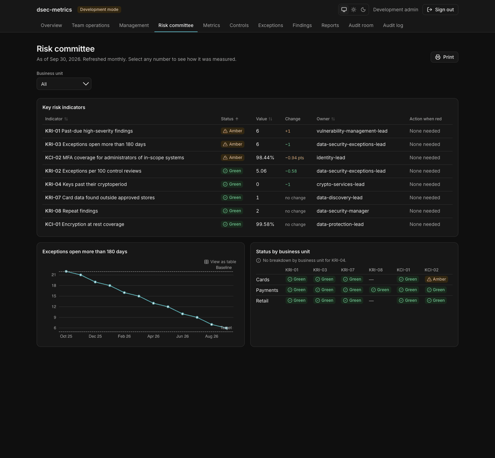

## Metrics

Every agreed indicator with its latest value and status. Each row opens the metric detail with its definition, history and source batches.

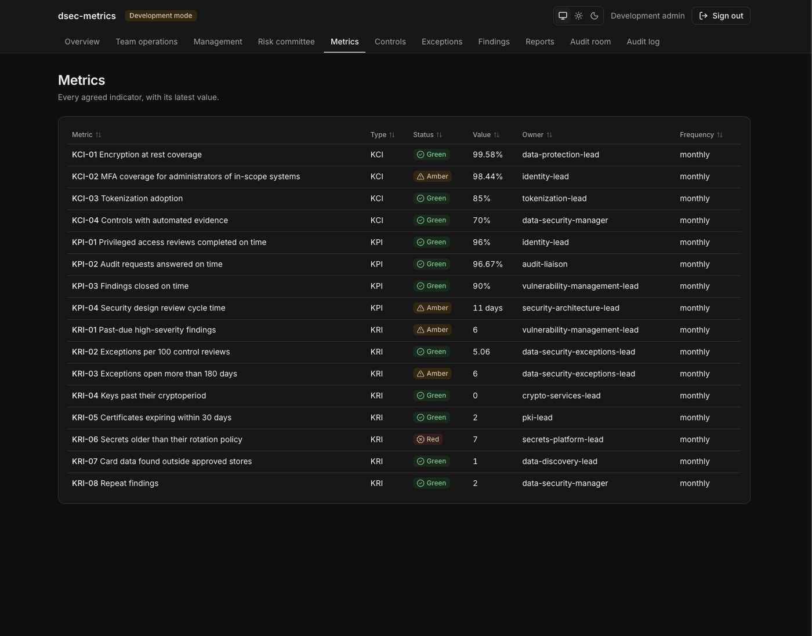

## Controls

Control status is the worst status of the control's metrics; controls without a metric show as unknown, never green.

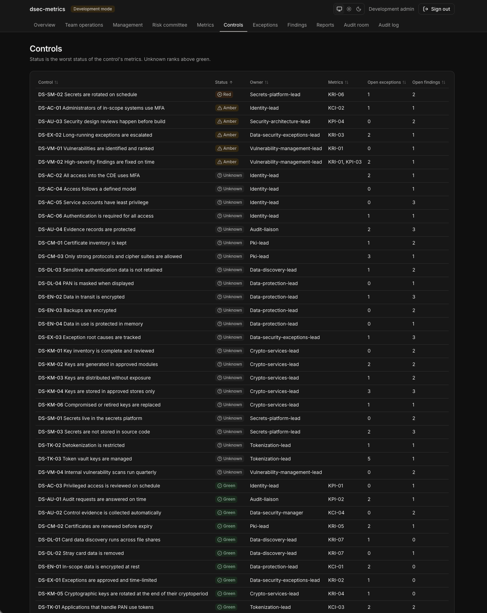

## Exceptions

The exceptions register read from the GRC tool, with aging, root causes and an expiry calendar.

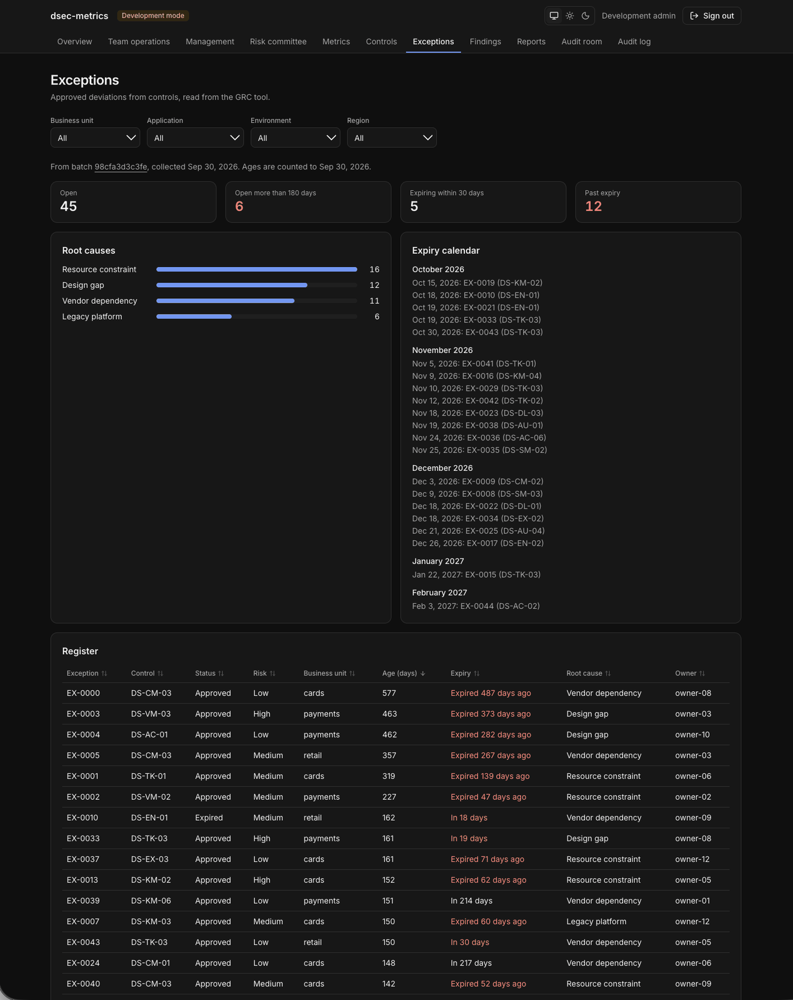

## Findings

Findings from audits and assessments, with days past due and repeat flags.

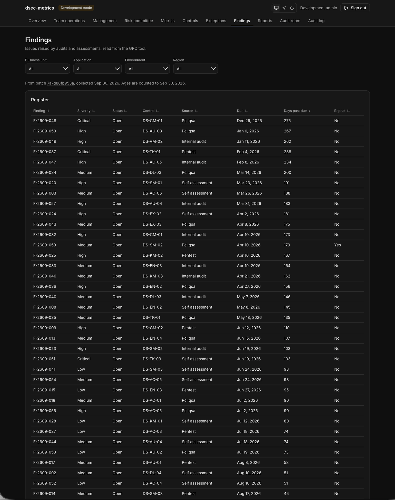

## Reports

Build a signed evidence package for any of the six report types. The page shows the command and key fingerprint anyone can use to verify a package.

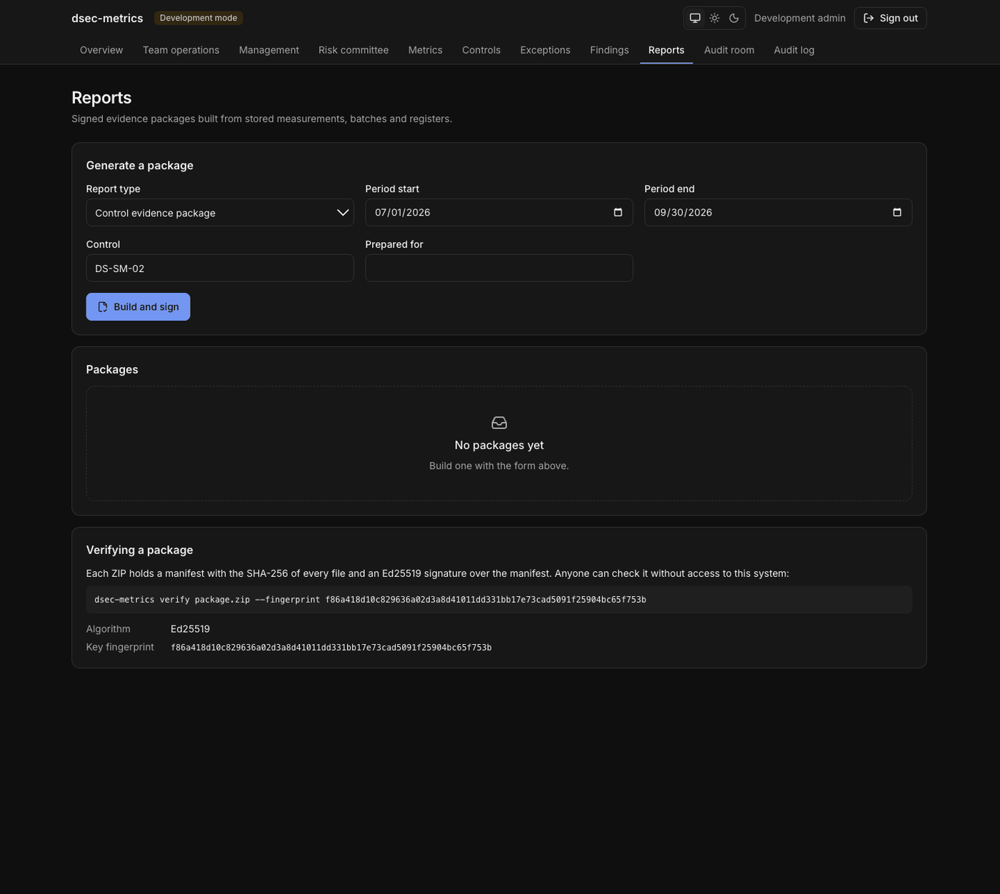

## Audit room

What auditors can see: their grants, the packages inside them, and every download.

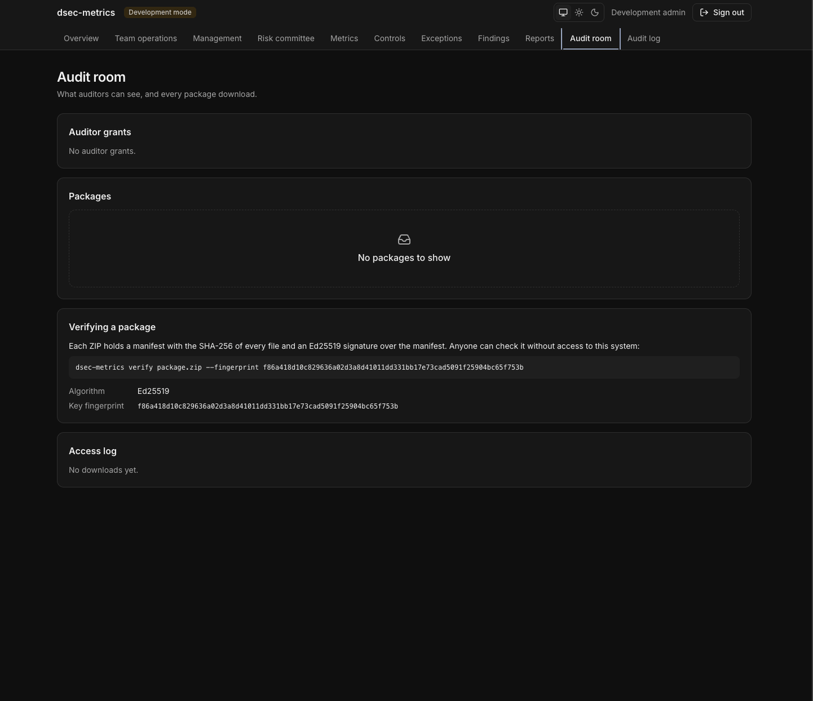

## Audit log

The hash-chained, append-only audit log, with a button that verifies the whole chain.

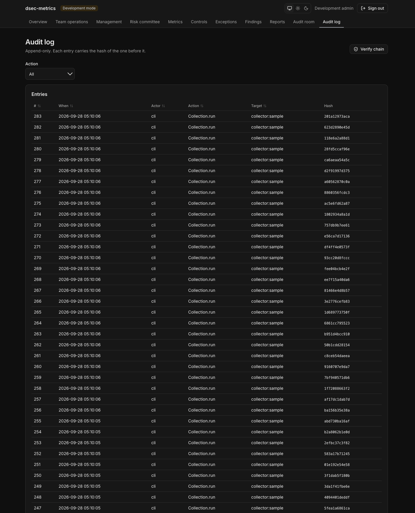
