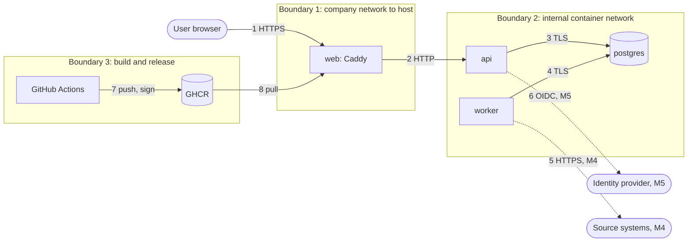

# Threat model

- Method: STRIDE per element of the data-flow diagram
- Status: first draft, end of M0
- Next review: end of M1, and at the end of every milestone after that

## Scope and assumptions

This draft covers what exists after M0 (the Compose stack, development sign-in, the images and the CI and release pipelines) and lists the planned components so later milestones start from a known baseline.

Assumptions:

- The platform runs inside a company network, behind the company's identity provider (from M5), on a host the company administers.
- The host, its Docker daemon and anyone with root on it are trusted. A compromised host is out of scope.
- Operators may be careless (default settings, reused certificates), so defaults must fail safe.
- Source systems (from M4) hold data the company considers sensitive, including cardholder data in scope for PCI DSS.

## Assets

| Asset | Why it matters |
| --- | --- |
| Measured results and evidence (M1 onward) | Wrong or altered numbers mislead auditors and risk committees |
| Collector credentials (M4) | Read access to cloud accounts, Vault, ticketing and source control |
| Session tokens | Impersonation of any user, later including admins and auditors |
| Password hashes (development only) | Offline cracking |
| Signing key for evidence packages (M3) | Forged packages that verify |
| The audit log (M3) | Hides tampering if it can be changed |
| Release images and their signatures | A malicious image running inside a bank's network |

## Data-flow diagram and trust boundaries

## STRIDE: components that exist now

| # | Element | Threat | Mitigation in place | Residual risk |
| --- | --- | --- | --- | --- |
| S1 | Sign-in | Spoofing by password guessing | Throttle per username and per source address; Argon2id; generic error message; timing equalized for unknown users | Distributed guessing across many addresses stays under the per-source limit; acceptable for development-only accounts |
| S2 | Session cookie | Spoofing with a stolen token | `__Host-` cookie, Secure, HttpOnly, SameSite=Strict; 256-bit tokens; only hashes stored; idle and absolute expiry | Token theft from a compromised browser is out of scope |
| S3 | Sign-in | Login CSRF | `Origin` must equal the configured public origin | None known |
| S4 | Local accounts | Development accounts reach production | Production mode refuses to start with local accounts; mode defaults to production; tested | An operator sets development mode in production. M5 adds a startup banner and a readiness failure in that case |
| T1 | API requests | Cross-site request forgery | Synchronizer CSRF token and `Origin` check on unsafe methods; SameSite=Strict | None known |
| T2 | Front-end assets | Script injection | CSP `script-src 'self'`, no inline scripts, React output encoding; e2e test fails on any console error, including CSP violations | A compromised npm dependency ships in the bundle. Mitigated by lock files, cooldown, osv-scanner and review |
| T3 | Postgres traffic | Tampering or reading on the network | TLS 1.3 with `verify-full`; `hostssl` only in `pg_hba.conf`; production refuses weaker `sslmode` | None known |
| T4 | Caddy to API hop | Reading or altering traffic between containers | Internal Docker network with no published port | Plain HTTP inside the host. Accepted for M0; M5 evaluates mTLS or a Unix socket |
| R1 | Sign-in events | A user denies an action | JSON security events on stdout for the SIEM (sign-in, sign-out, failure, throttle) | No tamper-evident audit table until M3 |
| I1 | Error responses | Leaking internals or echoing input | Generic messages; validation errors list field names only; no stack traces; `Server` and `Via` headers removed | None known |
| I2 | Secrets | Leaking the database password | Docker secrets as files, not environment variables; `SecretStr`; the password never appears in URL strings or logs | Secret files are world-readable inside a directory only the owner can open (containers run as different users). Production guidance in the deployment doc |
| I3 | OpenAPI docs | Mapping the API surface | Served only in development mode | None known |
| I4 | Dev CA | Trusting it lets someone intercept other sites | Name constraints, one-year lifetime, private key deleted after issuing two certificates | None known |
| D1 | API | Resource exhaustion | 1 MB request body limit at the proxy; memory and CPU limits per container; database connection pool limits | No general request rate limit yet. M2 adds rate limits on every route, as the brief requires |
| D2 | Sign-in | Throttle used to lock out a real user | Lockout is time-limited (15 minutes) and per username | An attacker can keep one known username locked. Acceptable for development accounts; OIDC replaces this in M5 |
| E1 | Containers | Container escape or privilege escalation | Non-root, read-only root filesystem, all capabilities dropped (Postgres keeps the five its entrypoint needs), `no-new-privileges`, no shell in our images | Kernel vulnerabilities are out of scope |
| E2 | Authorization | A new route ships without a check | One policy module; CI fails if a route has no policy or lacks allowed and denied tests | None known |

## STRIDE: build and release pipeline

| # | Threat | Mitigation in place | Residual risk |
| --- | --- | --- | --- |
| P1 | A compromised or retagged GitHub Action | Every action pinned to a commit SHA; zizmor audits workflows; Dependabot proposes updates after a one-week cooldown | A malicious commit behind a SHA that we choose to adopt |
| P2 | Workflow token abuse | `permissions: {}` by default, minimal per job; `persist-credentials: false`; no `pull_request_target`; no untrusted input in `run:` blocks | None known |
| P3 | A malicious dependency release | Hash-locked `uv.lock` and `pnpm-lock.yaml`; one-week cooldown; pnpm runs no install scripts; pip-audit and osv-scanner | A malicious package older than a week that no advisory covers yet |
| P4 | A tampered image in the registry | cosign keyless signatures, SLSA provenance and a CycloneDX SBOM attestation per image; verification commands documented | Operators who pull without verifying. M5 documents admission policies |
| P5 | A secret committed to the repository | gitleaks over full history in CI | Secrets that match no rule |

## Planned components (placeholders)

| Component | Milestone | Main threats to design for |
| --- | --- | --- |
| Collectors and redaction | M1, M4 | Credential theft, SSRF through the `rest` collector, card data stored unmasked, collectors with write access |
| Evaluator and measurements | M1 | Tampered inputs producing wrong statuses, silent `unknown` shown as green |
| Evidence packages and signing key | M3 | Key theft, forged or altered packages, auditor link sharing |
| Audit log | M3 | Deletion or rewriting of history |
| OIDC and RBAC | M5 | Token replay, role confusion, business-unit scope bypass |
| Notifiers | M6 | Data leaking to chat tools, webhook SSRF |

## Review log

| Date | Milestone | Change |
| --- | --- | --- |
| 2026-09-26 | M0 | First draft |
