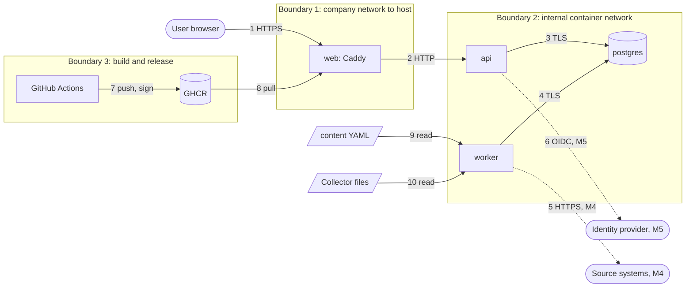

# Threat model

- Method: STRIDE per element of the data-flow diagram
- Status: updated at the end of M2
- Next review: end of M3, and at the end of every milestone after that

## Scope and assumptions

This version covers what exists after M2: the Compose stack, development sign-in, the images, the CI and release pipelines, definitions as code, the `file` and `sample` collectors, the redaction pipeline, the evaluator, stored measurements, the worker's scheduler, the read API and the dashboards. Planned components are listed at the end so later milestones start from a known baseline.

Assumptions:

- The platform runs inside a company network, behind the company's identity provider (from M5), on a host the company administers.
- The host, its Docker daemon and anyone with root on it are trusted. A compromised host is out of scope.
- Operators may be careless (default settings, reused certificates), so defaults must fail safe.
- Source systems (from M4) hold data the company considers sensitive, including cardholder data in scope for PCI DSS.

## Assets

| Asset | Why it matters |
| --- | --- |
| Measured results and evidence | Wrong or altered numbers mislead auditors and risk committees |
| Definitions in `content/` | Whoever changes a threshold or filter changes what the committee sees |
| Collected records | Can include personal data and, before redaction, cardholder data |
| Collector credentials (M4) | Read access to cloud accounts, Vault, ticketing and source control |
| Session tokens | Impersonation of any user, later including admins and auditors |
| Password hashes (development only) | Offline cracking |
| Signing key for evidence packages (M3) | Forged packages that verify |
| The audit log (M3) | Hides tampering if it can be changed |
| Release images and their signatures | A malicious image running inside a bank's network |

## Data-flow diagram and trust boundaries

## STRIDE: components that exist now

| # | Element | Threat | Mitigation in place | Residual risk |
| --- | --- | --- | --- | --- |
| S1 | Sign-in | Spoofing by password guessing | Throttle per username and per source address; Argon2id; generic error message; timing equalized for unknown users | Distributed guessing across many addresses stays under the per-source limit; acceptable for development-only accounts |
| S2 | Session cookie | Spoofing with a stolen token | `__Host-` cookie, Secure, HttpOnly, SameSite=Strict; 256-bit tokens; only hashes stored; idle and absolute expiry | Token theft from a compromised browser is out of scope |
| S3 | Sign-in | Login CSRF | `Origin` must equal the configured public origin | None known |
| S4 | Local accounts | Development accounts reach production | Production mode refuses to start with local accounts; mode defaults to production; tested | An operator sets development mode in production. M5 adds a startup banner and a readiness failure in that case |
| T1 | API requests | Cross-site request forgery | Synchronizer CSRF token and `Origin` check on unsafe methods; SameSite=Strict | None known |
| T2 | Front-end assets | Script injection | CSP `script-src 'self'`, no inline scripts, React output encoding; e2e test fails on any console error, including CSP violations | A compromised npm dependency ships in the bundle. Mitigated by lock files, cooldown, osv-scanner and review |
| T3 | Postgres traffic | Tampering or reading on the network | TLS 1.3 with `verify-full`; `hostssl` only in `pg_hba.conf`; production refuses weaker `sslmode` | None known |
| T4 | Caddy to API hop | Reading or altering traffic between containers | Internal Docker network with no published port | Plain HTTP inside the host. Accepted for M0; M5 evaluates mTLS or a Unix socket |
| R1 | Sign-in events | A user denies an action | JSON security events on stdout for the SIEM (sign-in, sign-out, failure, throttle) | No tamper-evident audit table until M3 |
| I1 | Error responses | Leaking internals or echoing input | Generic messages; validation errors list field names only; no stack traces; `Server` and `Via` headers removed | None known |
| I2 | Secrets | Leaking the database password | Docker secrets as files, not environment variables; `SecretStr`; the password never appears in URL strings or logs | Secret files are world-readable inside a directory only the owner can open (containers run as different users). Production guidance in the deployment doc |
| I3 | OpenAPI docs | Mapping the API surface | Served only in development mode | None known |
| I4 | Dev CA | Trusting it lets someone intercept other sites | Name constraints, one-year lifetime, private key deleted after issuing two certificates | None known |
| D1 | API | Resource exhaustion | Rate limits on every path per client address and per session, in middleware (M2); 1 MB body limit at the proxy and in the API, 411 for bodies without a length; paged batch records (at most 200 a page); memory and CPU limits per container; database connection pool limits | Many addresses together can still load the API; the limits are per address. Counters fail open if their table is unreachable, logged as a warning |
| D2 | Sign-in | Throttle used to lock out a real user | Lockout is time-limited (15 minutes) and per username | An attacker can keep one known username locked. Acceptable for development accounts; OIDC replaces this in M5 |
| E1 | Containers | Container escape or privilege escalation | Non-root, read-only root filesystem, all capabilities dropped (Postgres keeps the five its entrypoint needs), `no-new-privileges`, no shell in our images | Kernel vulnerabilities are out of scope |
| E2 | Authorization | A new route ships without a check | One policy module; CI fails if a route has no policy or lacks allowed and denied tests | None known |

## STRIDE: definitions, collection and evaluation (M1)

| # | Element | Threat | Mitigation in place | Residual risk |
| --- | --- | --- | --- | --- |
| T5 | Definition files | Code execution through YAML | Safe loader only, duplicate keys rejected, 1 MB file limit, strict Pydantic models; no expression language, `eval`, `exec` or pickle anywhere | None known |
| T6 | Definition files | A quiet threshold change hides a red metric | Definitions live in Git and change through review; each distinct definition is stored as a new version with its SHA-256; measurements record the version and hash they used; old measurements are never updated | Someone with write access to both the repository and the deployment can change a definition without review. M3's audit log and M6's editor record who synced what |
| T7 | Measurements | Altered numbers in the database | Insert-only by design, unique per metric, definition hash, date and slice; each row stores the hashes of its input batches so the number can be recomputed | A database administrator can still edit rows. M3 adds the hash-chained audit log and signed packages that make edits detectable |
| T8 | Scheduler table | Code execution through stored job data | Rows name a job from a fixed registry and carry string arguments only; nothing is imported or deserialized into objects. APScheduler was removed for this reason (ADR-0007, CVE-2026-31072) | Someone with write access to the table can trigger an allowed job early. The effect is an extra collection run |
| T9 | `file` collector | Reading files outside its directory | Relative paths only, no `..`, and the resolved path must stay inside `base_dir`; 50 MB limit | Files inside `base_dir` are trusted as data. Their contents go through redaction like any other source |
| I5 | Collected records | Cardholder data stored | Redaction runs in the pipeline before hashing and storage and cannot be skipped by a plugin: sensitive fields dropped, Luhn-valid 13 to 19 digit runs masked to first six and last four in values, keys, integers and nested data. A test pushes card numbers through every collector path and scans every application table | Numbers with other separators or split across fields. Collector authors must declare such fields sensitive (ADR-0008) |
| I6 | Collector errors | Secrets or record data in error messages | `CollectorError` and `SecretError` messages are written to be safe to log; scheduled job failures store only the exception type | A third-party plugin that puts data in its messages. The plugin guide says not to; M4 adds a review checklist |
| I7 | Secret references | Secrets in definitions or the database | Config holds `env://` or `file://` references; the resolver refuses plain values | A plugin config model that accepts a plain string where a reference was meant. Built-in models are reviewed; M4 adds a `SecretRef` type |
| D3 | Evaluation | Large inputs slow the worker | 50 MB file limit, 1 MB definition limit; evaluation is linear in the number of records | No limit yet on records per batch from future HTTP collectors. M4 adds one in the SDK |
| E3 | Collectors | A collector with write access to a source | Built-in collectors only read; `required_permissions` documents read-only scopes | Operators can still grant broader credentials than documented. M4's permission docs list the minimum |

## STRIDE: read API and dashboards (M2)

| # | Element | Threat | Mitigation in place | Residual risk |
| --- | --- | --- | --- | --- |
| I8 | Read API | A user sees business units they should not | Every query takes a scope; the filter runs on slices, batches and register records | Until M5 the scope allows every business unit for every signed-in user. Development mode only, so no production exposure yet |
| I9 | Batch viewer | Record contents shown to users | Records are shown exactly as stored, after redaction; card numbers are masked and sensitive fields dropped before storage | Redacted records can still hold names, hostnames or ticket text from source systems. M5 adds a role check on batch records |
| T10 | Dashboards | A filtered view shows unfiltered numbers and misleads a committee | A filter is honoured only when a stored slice matches exactly; otherwise the response says it was ignored and the UI shows a note | None known |
| T11 | Front end | Script injection through record contents or definitions | Values are rendered as text by React; no HTML from the API is injected; charts draw on canvas with canvas tooltips; CSP blocks inline scripts and styles, and the e2e suite fails on any console error | None known |
| S5 | Rate limit keys | Evading per-session limits with made-up cookies | Every request also counts against its address; session keys are hashes of the cookie | Address-level limits only for callers that rotate addresses |
| R2 | Reads | No record of who looked at what | Access logs from the proxy; sign-in events | Per-read audit events arrive with the audit log in M3, starting with auditor downloads |

Tampered collector inputs (a source system returning wrong data) are outside what the platform can detect. The platform's job is to show which batch, from which source and when, produced each number, so a wrong input can be traced.

## STRIDE: build and release pipeline

| # | Threat | Mitigation in place | Residual risk |
| --- | --- | --- | --- |
| P1 | A compromised or retagged GitHub Action | Every action pinned to a commit SHA; zizmor audits workflows; Dependabot proposes updates after a one-week cooldown | A malicious commit behind a SHA that we choose to adopt |
| P2 | Workflow token abuse | `permissions: {}` by default, minimal per job; `persist-credentials: false`; no `pull_request_target`; no untrusted input in `run:` blocks | None known |
| P3 | A malicious dependency release | Hash-locked `uv.lock` and `pnpm-lock.yaml`; one-week cooldown; pnpm runs no install scripts; pip-audit and osv-scanner | A malicious package older than a week that no advisory covers yet |
| P4 | A tampered image in the registry | cosign keyless signatures, SLSA provenance and a CycloneDX SBOM attestation per image; verification commands documented | Operators who pull without verifying. M5 documents admission policies |
| P5 | A secret committed to the repository | gitleaks over full history in CI | Secrets that match no rule |

## Planned components (placeholders)

| Component | Milestone | Main threats to design for |
| --- | --- | --- |
| HTTP collectors | M4 | Credential theft, SSRF through the `rest` collector, collectors with write access |
| Evidence packages and signing key | M3 | Key theft, forged or altered packages, auditor link sharing |
| Audit log | M3 | Deletion or rewriting of history |
| OIDC and RBAC | M5 | Token replay, role confusion, business-unit scope bypass |
| Notifiers | M6 | Data leaking to chat tools, webhook SSRF |

## Review log

| Date | Milestone | Change |
| --- | --- | --- |
| 2026-09-26 | M0 | First draft |
| 2026-09-27 | M2 | Added the read API and dashboards (I8, I9, T10, T11, S5, R2); rate limits now close D1 |
| 2026-09-27 | M1 | Added definitions, collection, redaction, evaluation and scheduler threats (T5 to T9, I5 to I7, D3, E3) |
